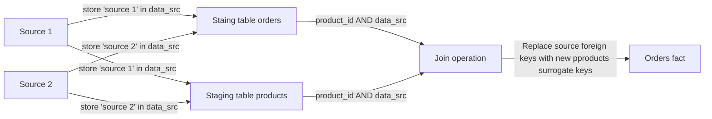
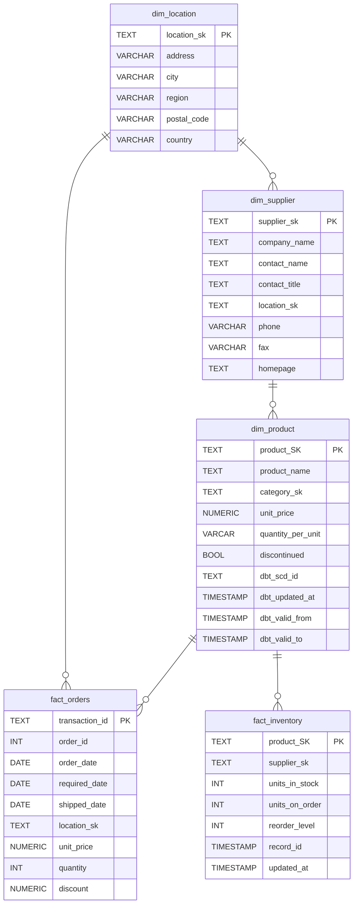

> **DISCLAIMER:** This project uses [northwind](https://docs.yugabyte.com/preview/sample-data/northwind/) as a source data, which is a publicly avaiable dataset.  
# Project Objectives
This project aims to craft a modern data warehouse solution that:
- Tracks orders by product, cateory and location.  
- Tracks product price chaneges using Slowly Chaning Dimension (SCD) type 2.
- Tracks Inventory data to conduct Safety stock analysis in the future.
# Business Logic
- `Cutomer names`, `products name`, `cateories`, `location data` are consistent a cross all sources.
- It's planned to integrate more ddata sources in the future.
# Approach



- Adding addition column in all staing tables called `data_src` to store source's name
- Assuming that `cutomer name`, `product name`, `cateorie`, `location data` doesn't cause conflicts, it's used as [Surrogate key](https://en.wikipedia.org/wiki/Surrogate_key) to replace **source's foreign keys**. `Surrogate key` can combine one or more **concatenated and catsted as text** columns using [MD5 hashing](https://en.wikipedia.org/wiki/MD5).
- `Source's foreign key` and `data_src` are used as [composite key](https://en.wikipedia.org/wiki/Composite_key) to replace `source's foreign key` with new `surrogate key`..
- If possible, the below logic can be used to generate `surrogate keys` instead of joining. 
## Surrogate keys logic
| Surrogate key | Logic |
|---------------|-------|
| **category_sk** | MD5 Hash of **cleaned** `category_name`|
| **product_sk**  | MD5 Hash of **cleaned** `product_name`|
| **supplier_sk** | MD5 Hash of **cleaned** `supplier_sk`|

********
# Data Lineage
.png)
# Limitations
## IO
`MD5` generates `128-bit digest` which utilises bigger `IO` compare to [`BIGINT`](https://www.postgresql.org/docs/current/datatype-numeric.html) `64-bits` type that has a range of `-9223372036854775808` to `+9223372036854775807` 

# ERD

# dbt Model Structure
``` bash
> tree ./northwind/models 
./northwind/models
├── db_staging
│   ├── db_staging.yaml
│   ├── stg_categories.sql
│   ├── stg_inventory.sql
│   ├── stg_order_details.sql
│   ├── stg_orders.sql
│   ├── stg_products.sql
│   └── stg_suppliers.sql
├── groups.yml
├── marts
│   ├── dimensions
│   │   ├── dim_category.sql
│   │   ├── dimensions.yml
│   │   ├── dim_location.sql
│   │   ├── dim_products.sql
│   │   └── dim_suppliers.sql
│   ├── inventory
│   │   ├── fact_inventory.sql
│   │   └── inventory.yml
│   └── orders
│       ├── fact_orders.sql
│       └── orders.yaml
└── source.yml

5 directories, 18 files
```