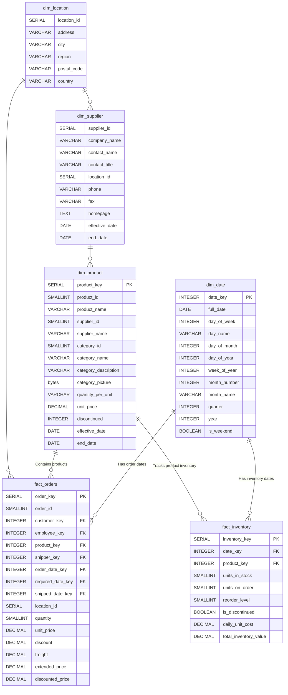

```mermaid
erDiagram
    dim_date {
        INTEGER date_key PK
        DATE full_date
        INTEGER day_of_week
        VARCHAR day_name
        INTEGER day_of_month
        INTEGER day_of_year
        INTEGER week_of_year
        INTEGER month_number
        VARCHAR month_name
        INTEGER quarter
        INTEGER year
        BOOLEAN is_weekend
    }
    
    dim_product {
        SERIAL product_key PK
        SMALLINT product_id
        VARCHAR product_name
        SMALLINT supplier_id
        VARCHAR supplier_name
        SMALLINT category_id
        VARCHAR category_name
        VARCHAR category_description
        bytes category_picture
        VARCHAR quantity_per_unit
        DECIMAL unit_price
        INTEGER discontinued
        DATE effective_date
        DATE end_date
    }

    dim_supplier {
        SERIAL supplier_id
        VARCHAR company_name
        VARCHAR contact_name
        VARCHAR contact_title
        SERIAL location_id
        VARCHAR phone
        VARCHAR fax
        TEXT homepage
        DATE effective_date
        DATE end_date
    }

    dim_location {
        SERIAL location_id
        VARCHAR address
        VARCHAR city
        VARCHAR region
        VARCHAR postal_code
        VARCHAR country
    }
    fact_orders {
        SERIAL order_key PK
        SMALLINT order_id
        INTEGER customer_key FK
        INTEGER employee_key FK
        INTEGER product_key FK
        INTEGER shipper_key FK
        INTEGER order_date_key FK
        INTEGER required_date_key FK
        INTEGER shipped_date_key FK
        SERIAL location_id 
        SMALLINT quantity
        DECIMAL unit_price
        DECIMAL discount
        DECIMAL freight
        DECIMAL extended_price
        DECIMAL discounted_price
    }

    fact_inventory {
        SERIAL inventory_key PK
        INTEGER date_key FK
        INTEGER product_key FK
        SMALLINT units_in_stock
        SMALLINT units_on_order
        SMALLINT reorder_level
        BOOLEAN is_discontinued
        DECIMAL daily_unit_cost
        DECIMAL total_inventory_value
    }

    dim_date ||--o{ fact_orders : "Has order dates"
    dim_date ||--o{ fact_inventory : "Has inventory dates"
    dim_product ||--o{ fact_orders : "Contains products"
    dim_product ||--o{ fact_inventory : "Tracks product inventory"
    dim_supplier ||--o{ dim_product:""
    dim_location ||--o{ dim_supplier:""
    dim_location ||--o{ fact_orders:""
```