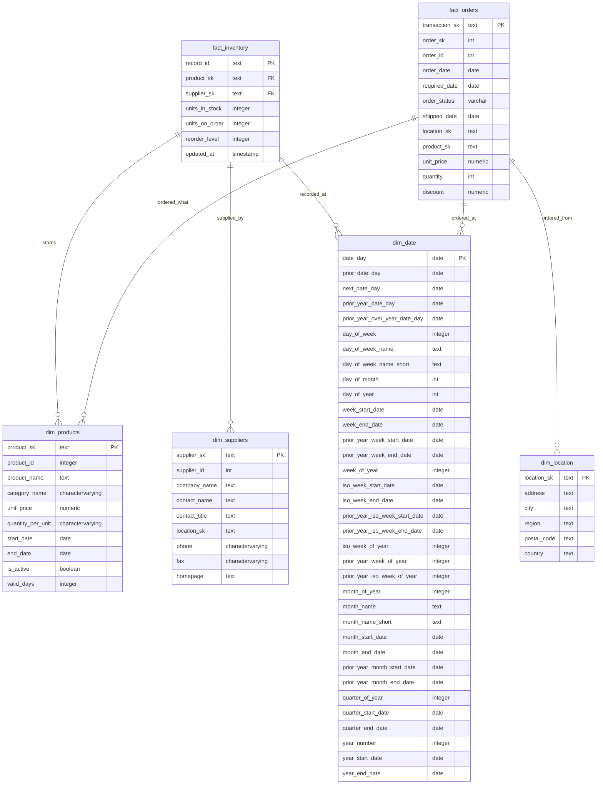

# Northwind-dbt 🔨

> **DISCLAIMER:** This project uses [northwind](https://docs.yugabyte.com/preview/sample-data/northwind/) as source data, which is a publicly avaiable dataset.  

# 🤓 What is special about this?

- **Unit tests 📑**: Quality `data tests`, and `unit tests` to simulate business scenarious.            

- **Data Tests 📑**: Simple, but save these errors in a seperate table to curate them later.

- **Models Versioning ✨**: Two versioned models, `stg_inventory` and `fact_inventory`.

- **CI/CD 👾**: Initialize test-environment, build models, run models in `incremental_mode`, run `data tests`, and run `unit tests` in isolated environment before merging into `main` branch - using `Github Actions`.

- **Enforced Schema ✊**: Prevents unexpected `data quality` issues caused by changes in the source schema.

- **Slowly Chaning Dimension (SCD) type 2 🐢**: Products SCD but with old way.

# 🤔 Project Objectives
This project aims to craft a modern data warehouse solution that:
- 🤖 Track `orders` by `product`, `cateory` and `location`.  
- 🤖 Track `product price chaneges effect on orders`.
- 🤖 Track `Inventory` data to conduct Safety stock analysis in the future.

# ERD

This is how I modeled the data—guided by **Ralph Kimball’s principles** in **The Data Warehouse Toolkit** 📖.

# 🤯 Data Lineage
> **🤸 Note** the two versions of `stg_inventory` and `fact_inventory`, `unit tests` are also included.                 

