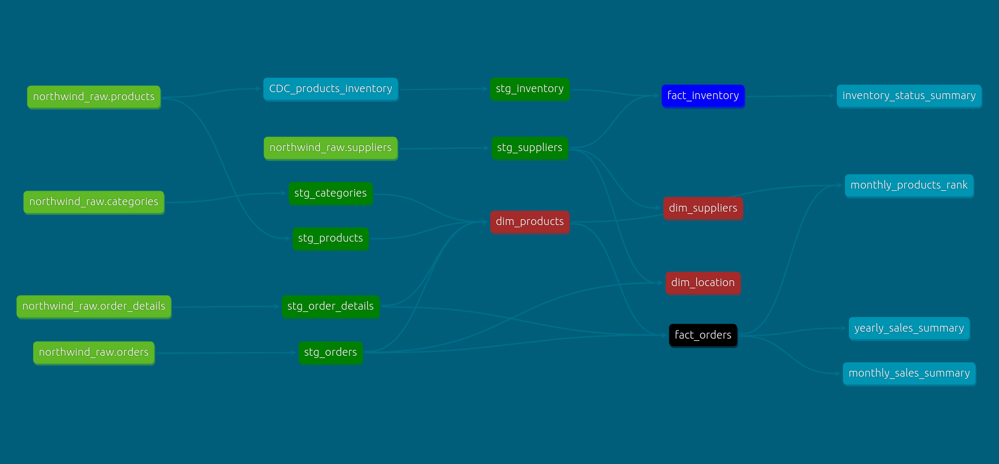
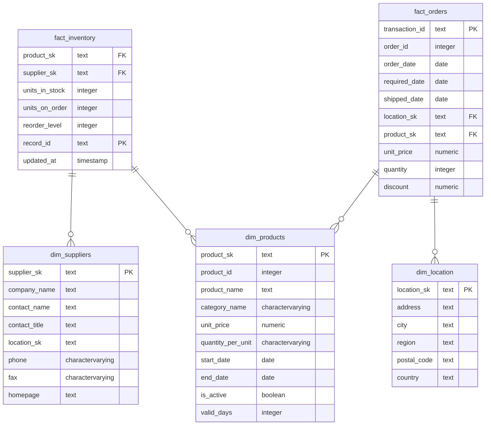

> **DISCLAIMER:** This project uses [northwind](https://docs.yugabyte.com/preview/sample-data/northwind/) as source data, which is a publicly avaiable dataset.  
# Project Objectives
This project aims to craft a modern data warehouse solution that:
- Tracks orders by product, cateory and location.  
- Tracks product price chaneges using Slowly Chaning Dimension (SCD) type 2.
- Tracks Inventory data to conduct Safety stock analysis in the future.
# Business Logic
- `Cutomer names`, `products name`, `cateories`, `location data` are consistent a cross all sources.


# Data Lineage



# ERD

# dbt Model Structure
``` bash
> tree ./northwind/models 
./northwind/models
├── db_staging
│   ├── db_staging.yaml
│   ├── stg_categories.sql
│   ├── stg_inventory.sql
│   ├── stg_order_details.sql
│   ├── stg_orders.sql
│   ├── stg_products.sql
│   └── stg_suppliers.sql
├── groups.yml
├── marts
│   ├── dimensions
│   │   ├── dim_category.sql
│   │   ├── dimensions.yml
│   │   ├── dim_location.sql
│   │   ├── dim_products.sql
│   │   └── dim_suppliers.sql
│   ├── inventory
│   │   ├── fact_inventory.sql
│   │   └── inventory.yml
│   └── orders
│       ├── fact_orders.sql
│       └── orders.yaml
└── source.yml

5 directories, 18 files
```
